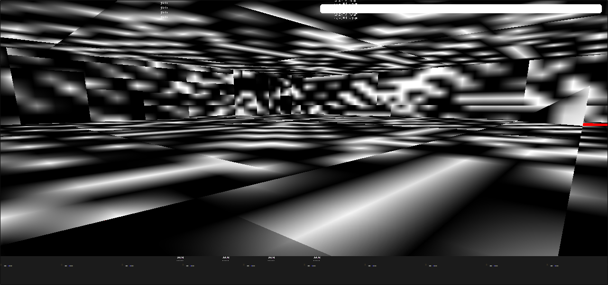

	

	
	
	

# OGS Engine

>Gold Source is a version of Quake and Quake is open source so maybe that is an option for you.
>
>Kind regards,
>
>Mike

GoldSource Engine Clone Prototype

Clean open source reimplementation of the GoldSource game engine  
Based on original Quake (Id Tech 2) engine sources

For more information about the project you can visit its official [Wiki](https://gitlab.com/BlackPhrase/OGS/wikis/home)

## Getting Started
## Mini-Q&A

These instructions will get you a copy of the project up and running on your local machine for development and testing purposes. 
**Q: What's this?**  
**A:** This is a [GoldSource](https://en.wikipedia.org/wiki/GoldSrc) game engine reimplementation using only original id Tech 2 engine (NetQuake/QuakeWorld/Quake 2) sources (and 
its forks) and no reverse-engineered code (like from ReHLDS or Xash3D)

### Prerequisites

In order to build the engine you need to have the following software installed on your system:
* CMake >= 3.8
* MinGW-W64 >= 8.1.0

You should be able to successfully build the engine having only this stuff

### Building

**NOTE:** Only MinGW build was tested so far. If you need engine binaries build by MSVC/Clang/other compilers then you're currently obligated to do that 
yourself

**NOTE:** At this state only hardware engine configuration (gl render) is supported. Dedicated mode should also be supported, but it's not fully "dedicated" yet

Configure your build in 'cmake-gui' by choosing the location of engine sources and location which will be used for building purposes. Choose the compiler of your 
preference and select the needed options (or leave everything as-is, it should compile fine). Fill the 'CMAKE_BUILD_TYPE' field with either "Debug" or "Release" 
(untested) and you should be good to go and can hit 'Configure' and 'Generate' buttons. Now your can open your favorite IDE or Git Bash console and build the project

If your experiencing issues with either the build process or with following the build instructions - feel free to open a new repo issue and let the developers know 
about that so they can fix that and provide help

### Installing

All built binaries will be located in "%your chosen location%/bin" folder. You need to manually copy/move them into your game directory

### Running

It is recommended to launch the engine with the following command line arguments:

>-window -width 1280 -height 600 -force -developer 5 -condebug -gamma 1 +developer -zone 32768

**Q: What's the purpose?**  
**A:** If you can't see the purpose then you simply don't need it and you're just wasting your time here

**Q: So no usage of reverse-engineered code at all?**  
**A:** Nope, only backtrace logs and a lot of researching of original GS engine history

**Q: How much the GoldSource engine is different from the original Quake engine?**  
**A:** Let's say it's pretty much a "dieselpunk" version of the Quake engine

**Q: What are the "backtrace logs"?**  
**A:** Call stack of the latest called program functions/class methods before crash of the program. 
This information allows you to see which function caused the crash and its location in source code. 
(Backtrace logs don't show you the actual source code)

**Q: Will the engine be able to run my precious (%MODNAME%)?**  
**A:** Technically, it's possible to interconnect the reimplemented engine with original mods written 
using HLSDK, its license doesn't explicitly forbids to do that, but that's at your own risk. And only for non-commercial use. 
The game dlls compiled from the HLSDK code will still be licensed under terms of Half-Life SDK License, I can only permit to link 
the GPL3 OGS code with them as a special exception

**Q: Can I use the HLSDK to create a mod for this engine?**  
**A:** Nope, HLSDK EULA expects that any modification created using it will be used only by the original 
GoldSrc engine. You need to reimplement the game code yourself or use the reimplemented OGS SDK template game code based on Quake's QC progs code 
(if it's present at the time you reading this, I'm not planning to reimplement the game code for this engine for now, can't say for sure, but 
I doubt that anyone else decides to rewrite the game code for this engine, so it probably end up being used as a tech demo of the GoldSrc 
showcasing its features using some recreated HL Alpha maps)

## Contributing

Feel free to create issues or pull-requests if you have any problems or you want to support the project. 
Any help is appreciated (especially from coders and documentation/wiki writers). 
Please read the [Contributing Guidelines](CONTRIBUTING.md) before providing any changes and for additional information

## Screenshots

## License

* [GNU GPL v3+](LICENSE) for most of the codebase;  
* MIT for ogs-interface code ("Valve's interface/module factory" reimplementation; located in "goldsrc/tier1" and "goldsrc/public/tier1" folders);  
* [BSD-3](https://github.com/ValveSoftware/GameNetworkingSockets/blob/master/LICENSE) for pieces taken from the GameNetworkingSockets repo (tier0/vstdlib sources and headers written by Valve for original GS engine);