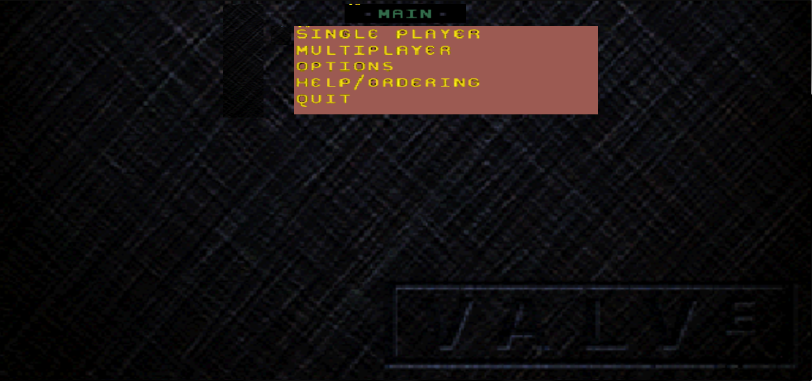
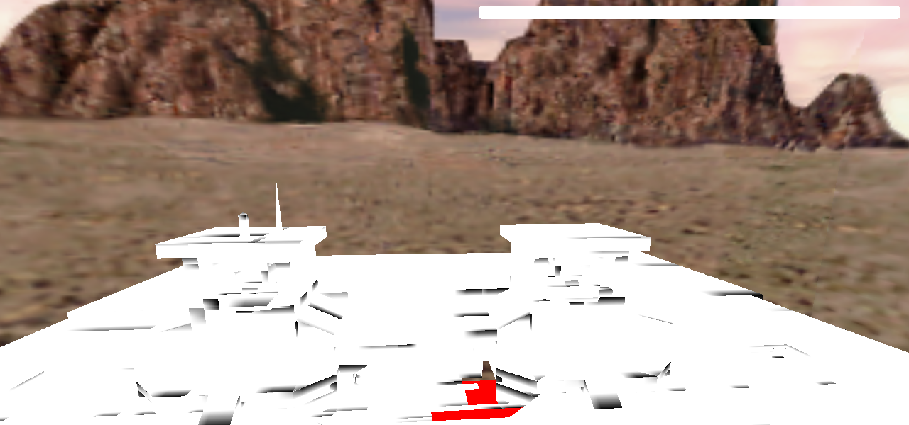
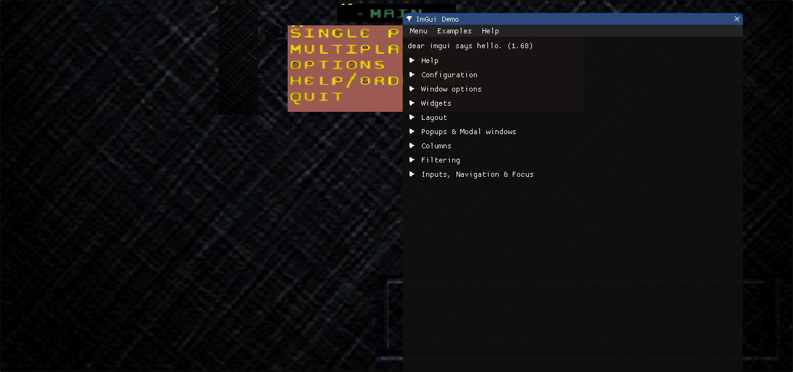

<p align="center">
	<a href="https://gitlab.com/headcrab-junkyard/OGS">
		
	</a>
</p>

<p align="center">
	<a href="https://ci.appveyor.com/project/headcrab-junkyard/OGS">
		
	</a>
	<a href="https://codeclimate.com/github/headcrab-junkyard/OGS/issues">
		
	</a>
</p>

# OGS Engine

https://github.com/ValveSoftware/halflife/issues/1712#issuecomment-272569051

>Gold Source is a version of Quake and Quake is open source so maybe that is an option for you.
>
>Kind regards,
>
>Mike

## Overview

This is a [GoldSource](https://en.wikipedia.org/wiki/GoldSrc) game engine reimplementation. It's based on an original WinQuake/NetQuake codebase (just like Valve did with GoldSrc). Various improvements and fixes from QuakeWorld (client-side prediction code, console commands, client-server connection mechanics), Quake 2 (renderer improvements, game dll interface) and Quake 3 (improved net messaging system) code bases were applied above it. There is also some other Quake engine forks were used to implement certain features. It doesn't use any of the reverse-engineered code (like from ReHLDS or Xash3D engine).

The original Quake progs code was reused the same way as Valve did for their Half-Life and was moved out of the repo into its own and now can be found [here](https://gitlab.com/headcrab-junkyard/openlambda). It's GPLv3-licensed and is fully compatible with the engine. It uses the same APIs so technically it should possible to run the original HLSDK compiled binaries with this engine.

The engine SDK was also rewritten (and still being in process of) to be compatible with GPL license and can be found [here](https://gitlab.com/headcrab-junkyard/ogs-sdk).

There is an ongoing process of rewriting the VGUI2 library to make it usable by the GameUI and Client DLL code. It's not fully functional yet but also required in order to run the engine. You can find it [here](https://gitlab.com/headcrab-junkyard/vgui2-reimp).

Some of the key features of GoldSrc engine were also implemented, partially implemented or waiting to be implemented by using features of other Quake engine forks (and trying not to reinvent the wheel).

For more information about the project you can visit its official [Wiki](./wiki).

## Getting Started

These instructions will get you a copy of the project up and running on your local machine for development and testing purposes. 
See deployment for notes on how to deploy the project on a live system.

### Prerequisites

What things you need to install the software and how to install them.

In order to build the engine you need to have the following software installed on your system:
* CMake >= 3.8
* MinGW-W64 >= 8.1.0

You should be able to successfully build the engine having only this stuff.

```
Give examples
```

### Building

**NOTE:** Only MinGW build was tested so far. If you need engine binaries built by MSVC/Clang/other compilers then you're currently obligated to do that 
yourself.

**NOTE:** At this state only hardware engine configuration (gl render) is supported. Dedicated mode should also be supported, but it's not fully "dedicated" yet.

Configure your build in 'cmake-gui' by choosing the location of engine sources and location which will be used for building purposes. Choose the compiler of your 
preference and select the needed options (or leave everything as-is, it should compile fine). Fill the 'CMAKE_BUILD_TYPE' field with either "Debug" or "Release" 
(untested) and you should be good to go and can hit 'Configure' and 'Generate' buttons. Now your can open your favorite IDE or Git Bash console and build the project.

If your experiencing issues with either the build process or with following the build instructions - feel free to open a new repo issue and let the developers know 
about that so they can fix that and provide help.

### Installing

All built binaries will be located in "%your chosen location%/bin" folder. You need to manually copy/move them into your game directory

A step by step series of examples that tell you have to get a development env running

Say what the step will be

```
Give the example
```

And repeat

```
until finished
```

End with an example of getting some data out of the system or using it for a little demo

### Running

It is recommended to launch the engine with the following command line arguments:

>-window -width 1280 -height 600 -force -dev 5 -condebug -gamma 1 +dev -zone 32768

## Mini-Q&A

**Q: What's the purpose?**  
**A:** If you can't see the purpose then you simply don't need it and you're just wasting your time here.

**Q: So no usage of reverse-engineered code at all?**  
**A:** Nope, only backtrace logs and a lot of researching of original GS engine history.

**Q: How much the GoldSource engine is different from the original Quake engine?**  
**A:** Let's say it's pretty much a "dieselpunk" version of the Quake engine.

**Q: What are the "backtrace logs"?**  
**A:** Call stack of the latest called program functions/class methods before crash of the program. 
This information allows you to see which function caused the crash and its location in source code. 
(Backtrace logs don't show you the actual source code).

**Q: Will the engine be able to run my precious (%MODNAME%)?**  
**A:** Technically, it's possible to interconnect the reimplemented engine with original mods written 
using HLSDK, its license doesn't explicitly forbids to do that, but that's at your own risk. And only for non-commercial use. 
The game dlls compiled from the HLSDK code will still be licensed under terms of Half-Life SDK License, I can only permit to link 
the GPL3 OGS code with them as a special exception.

**Q: Can I use the HLSDK to create a mod for this engine?**  
**A:** Nope, HLSDK EULA expects that any modification created using it will be used only by the original 
GoldSrc engine. You need to reimplement the game code yourself or use the reimplemented OGS SDK template game code based on Quake's QC progs code 
(if it's present at the time you reading this, I'm not planning to reimplement the game code for this engine for now, can't say for sure, but 
I doubt that anyone else decides to rewrite the game code for this engine, so it probably end up being used as a tech demo of the GoldSrc 
showcasing its features using some recreated HL Alpha maps).

## Contributing

Feel free to create issues or pull-requests if you have any problems or you want to support the project. 
Any help is appreciated (especially from coders and documentation/wiki writers). 
Please read the [Contributing Guidelines](CONTRIBUTING.md) before providing any changes and for additional information.

## Credits

OGS engine is using original WinQuake codebase as a base and some of the QuakeWorld, Quake 2 and Quake 3 code pieces applied above it. It also integrates various parts from other Quake engine forks developed by other people throughout the time. Thanks to everyone which work became part of the engine. For the full list see the [Credits](CREDITS.md) file.

## Screenshots





## License

* [GNU GPL v3+](LICENSE) for most of the codebase;  
* [GNU LGPL v3+](goldsrc/optional/vguiwrap/LICENSE) for vguiwrap module sources;  
* [MIT](goldsrc/engine/imgui/LICENSE.txt) for imgui integration code based on original imgui examples code;  
* [BSD-3](https://github.com/ValveSoftware/GameNetworkingSockets/blob/master/LICENSE) for pieces taken from the GameNetworkingSockets repo (tier0/vstdlib sources and headers written by Valve for original GS engine);